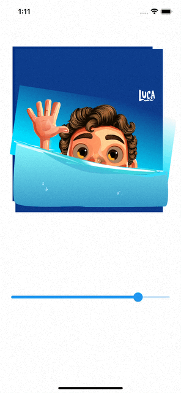
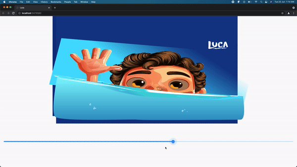
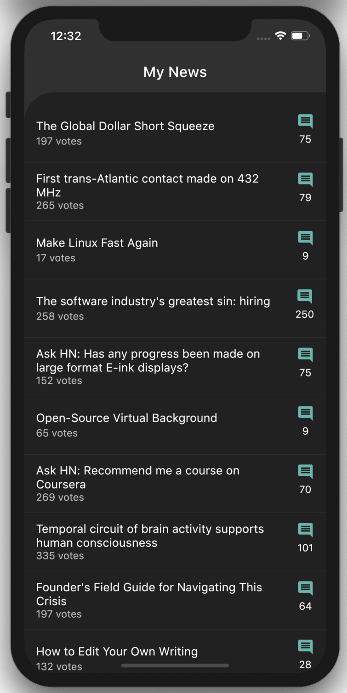
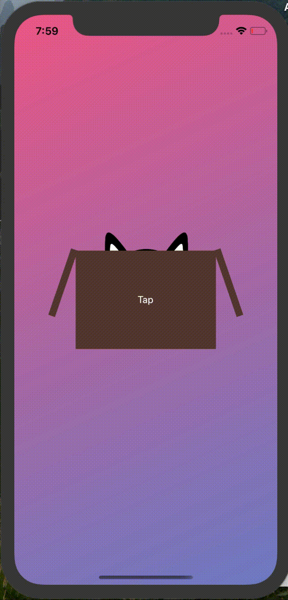
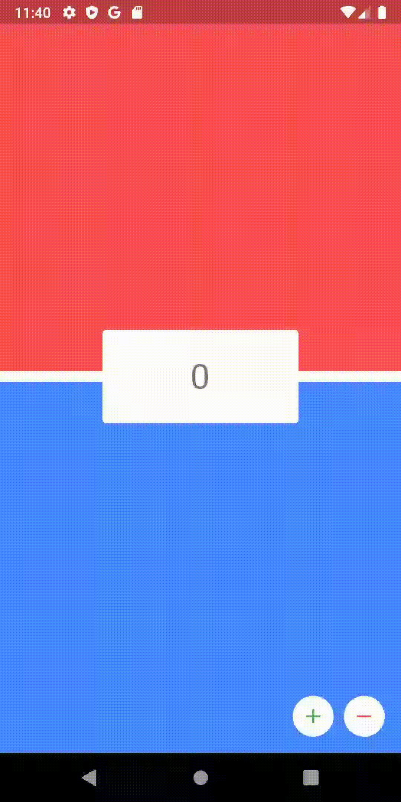
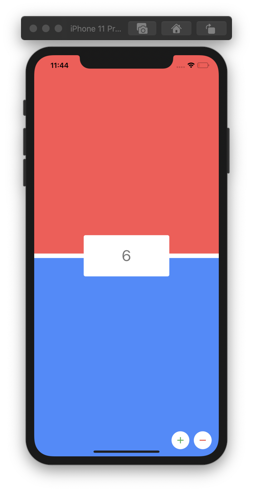

# FlutterCreations
This Repository Contains Examples created using flutter.

<table>
   <tr>
    <td><h2>Luca from Pixar</h2></td>
  </tr>
  <tr>
     <td>IOS (Rendering 8600 lines of Custom Painter)</td>
    </td>
     <td>WEB (Rendering 8600 lines of Custom Painter)</td>
    </td>
  <tr>
    <td></td>
      <td></td>
  </tr>
  <tr>
    <td><h2>MyNews</h2></td>
  </tr>
  <tr>
    <td>Android</td>
     <td>IOS</td>
    </td>
  <tr>
  <td></td>
    <td></td>
  </tr>
  
  
  
  <tr>
    <td><h2>Cat Animation</h2></td>
  </tr>
  <tr>
    <td>Android</td>
     <td>IOS (slow due to recorder)</td>
    </td>
  <tr>
  <td></td>
    <td></td>
  </tr>
  <tr>
    <td><h2>MyNews</h2></td>
  </tr>
  <tr>
    <td>Android</td>
     <td>IOS</td>
    </td>
  <tr>
  <td></td>
    <td></td>
  </tr>
  
   <td><h2>CounterExample flutterBloc 4.0</h2></td>
  </tr>
  <tr>
    <td>Android</td>
     <td>IOS</td>
    </td>
  <tr>
  <td></td>
    <td></td>
  </tr>
 </table>
